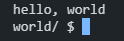

# 👨‍💻 CS50 Problem Set Solutions

## Introduction  
This repository contains my solutions to the problem sets from **Harvard's CS50: Introduction to Computer Science**. CS50 is an intensive introduction to computer science that covers fundamental programming concepts, algorithms, and data structures using languages like **C, Python, SQL, and JavaScript**.  

Each problem set challenges students with practical programming tasks that reinforce computational thinking and problem-solving skills. Below, you will find an organized list of all the problem sets, each with its respective exercises that i did between january and march 2025

---

### Week 1 – C  

- **Hello** – Famous Basic C program that prints "hello, world."

- **Hello Name** – Little twist of the "hello, world" where user need to input a name and prints "hello, name"

- **Mario (More)** – Ask height and prints a pyramid of blocks inspired by Super Mario.

- **Cash** – A greedy algorithm to determine the minimum number of coins for change.  
- **Credit** – A program that validates credit card numbers using Luhn’s Algorithm.  

### Week 2 – Arrays  
- **Readability** – Determines the reading level of a given text using the Coleman-Liau index.  
- **Caesar** – Implements a simple Caesar cipher for text encryption.  
- **Substitution** – Implements a more flexible substitution cipher.  

### Week 3 – Algorithms  
- **Plurality** – Implements a simple plurality voting system.  
- **Runoff** – Simulates a runoff election using an elimination system.  
- **Tideman** – Implements a ranked-choice voting system using graph theory.  

### Week 4 – Memory  
- **Filter** – Applies image filters like grayscale and blur using image processing techniques.  
- **Recover** – Recovers deleted JPEG files from a raw memory file.  

### Week 5 – Data Structures  
- **Speller** – Implements a spell checker using a hash table.  

### Week 6 – Python  
- **Hello** – Basic Python program that prints "hello, world."  
- **Mario (Less & More)** – Re-implementation of the Mario pyramid in Python.  
- **Cash** – Change-making problem solved in Python.  
- **Credit** – Credit card validation using Python.  

### Week 7 – SQL  
- **Movies** – Queries a database of movies to find specific information.  

### Week 8 – Web Programming  
- **Homepage** – A simple personal website using HTML, CSS, and JavaScript.  

---

## 📸 Screenshots  
*(Add your screenshots here to illustrate your solutions.)*  

Feel free to explore each problem set folder for the source code and explanations of my solutions! 🚀  
