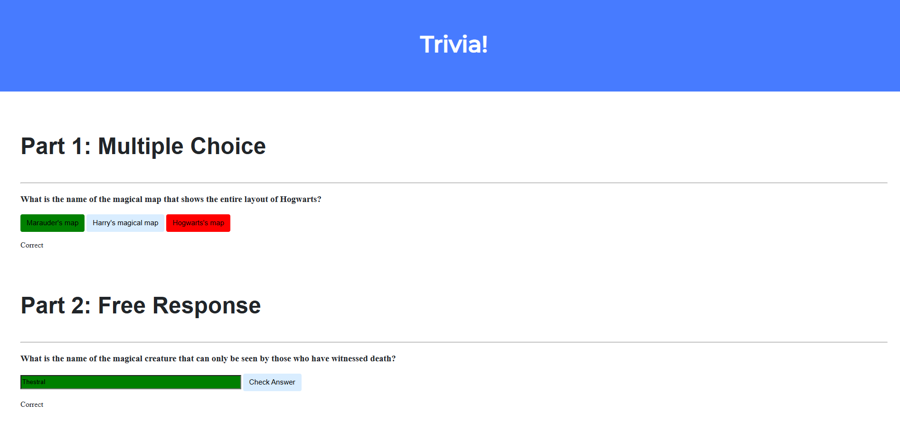
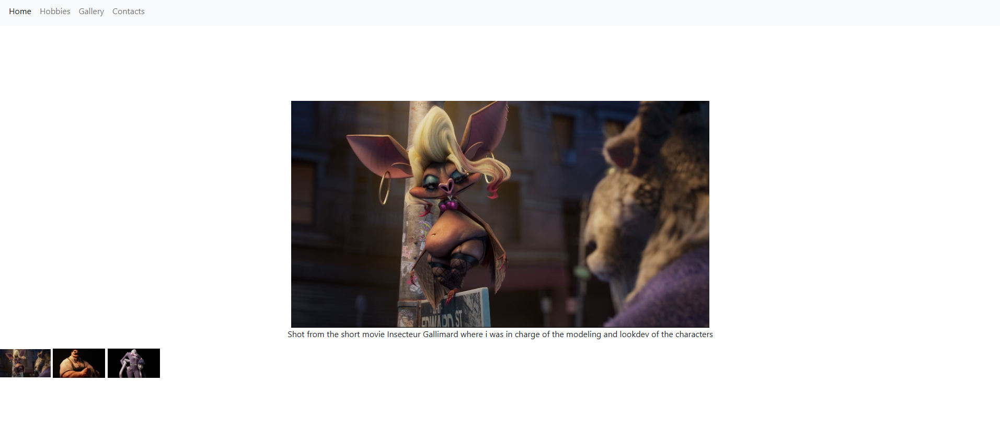
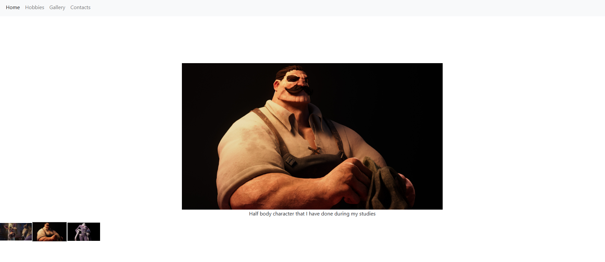
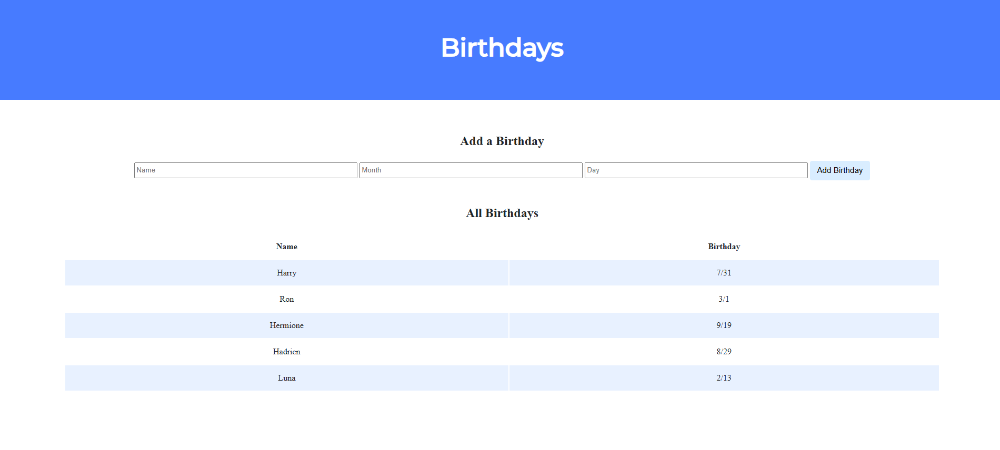

#      Programming challenges

## Introduction  

This repository showcases my approach to various programming challenges I have tackled, organized into different categories. Each project reflects my problem-solving skills and learning experiences across multiple domains.  

Feel free to check the code and the comments!

---

## 01 - Basics of the language C 

- **Hello World** – Famous Basic C program that prints "hello, world."

- **Hello Name** – Little twist of the "hello, world" where user need to input a name and prints "hello, name"

- **Pyramid Printer** – Ask height and prints a pyramid of blocks inspired by Super Mario.

  
- **Credit Card Checker** – A program that verifies credit card numbers using Luhn’s Algorithm and identifies the card network.
 

---

## 02 - Arrays  

- **Scrabble** - Simple scrabble-like program that give points depending on letters for a given word.

- **Check Reading Level** – Determines the reading level of a given text using the Coleman-Liau index.

- **Cipher a text** – Implements a more flexible substitution cipher.

---

## 03 - Algorithms  

  
- **Plurality Vote** – Implements a simple plurality voting system.

- **Tideman Vote** – Implements a ranked-choice voting system using graph theory.

---

## 04 - Memory

- **Volume Changer** – Modify an input’s volume by adjusting its memory allocation.
  
  

  
  
Sounds

  
  
  https://github.com/user-attachments/assets/dc9e0ad2-6342-45ba-9b8e-7dadc155ab29
  > Base - 1.0
  
  
  https://github.com/user-attachments/assets/d5a8ff06-b469-4533-9626-6f1303c43b6e
  > Halfed - 0.5
  
  
  https://github.com/user-attachments/assets/03705c17-33ec-4d25-8db4-8a3e855ed4a8
  > Doubled - 2.0
  
  ---
  

- **Basics filters for images** – Applies image filters like grayscale, blur, reversed and edge detection using image processing techniques.

  

  
  
Filter images

    
  
  > Base image
  
  
  > Grayscale generated
  
  
  > Reverse image generated
  
  
  > Blur generated
  
  
  > Edge detection generated
  
  ---
  

- **Recovering** – Script that recovers deleted JPEG files from a raw memory file.

---

## 05 - Data Structures

  
- **Blood type simulation** – Simulates blood type inheritance across generations using a recursive tree-like structure.

- **Spelling Mistakes** – Implements a spell checker using a hash table.

---

## 06 - Python  

- **Hello World #2** – Basic Python program that prints "hello, world."

  
- **Pyramid printer #2** – Re-implementation of the Mario pyramid in Python.

- **Credit card checker #2** – Credit card validation using Python.

- **Check Reading Level #2** – Determines the reading level of a given text using the Coleman-Liau index.

- **DNA identifier** - Identifies the owner of a DNA sequence by comparing STR counts with a database of known individuals.

---

## 07 - Web Programming 

- **Quizz game** – A simple website using HTML, CSS, and JavaScript in form of a quizz.
  

- **Personal Site** – A simple personal website using HTML, CSS, and JavaScript, with an interactive gallery.

 

- **Friends Birthdays App** – Flask web app using SQLite to view and add friends' birthdays.

- **Finance** – Web app where users can manage their portfolios by "buying" and "selling" stocks, viewing their stock holdings and transactions, and checking real-time stock prices through an integrated API.

https://github.com/user-attachments/assets/87e3298c-1bf4-4b3a-bd0c-514790665e3d

---

## Disclaimer  

This repository contains projects and code inspired by various programming challenges and coursework I have completed. However, it does **not** contain direct solutions to any coursework or other academic assessments.  

The purpose of this repository is to showcase my programming skills, problem-solving abilities, and learning experiences.

If you are a student, I encourage you to complete assignments independently to ensure academic integrity and adhere to your institution’s honor code.  

---
