# 👨‍💻 Problem sets collection

## Introduction  
This repository contains my solutions to the problem sets from **Harvard's CS50: Introduction to Computer Science**. CS50 is an intensive introduction to computer science that covers fundamental programming concepts, algorithms, and data structures using languages like **C, Python, SQL, and JavaScript**.  

Each problem set challenges students with practical programming tasks that reinforce computational thinking and problem-solving skills. Below, you will find an organized list of all the problem sets, each with its respective exercises that i did between january and march 2025

---

## 01 - Basics of the language C 

Hello, Hello Name, Mario, Credit

- **Hello** – Famous Basic C program that prints "hello, world."

- **Hello Name** – Little twist of the "hello, world" where user need to input a name and prints "hello, name"

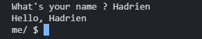

- **Mario (More)** – Ask height and prints a pyramid of blocks inspired by Super Mario.

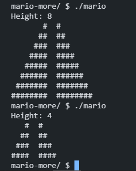
  
- **Credit** – A program that verifies credit card numbers using Luhn’s Algorithm and identifies the card network.
 
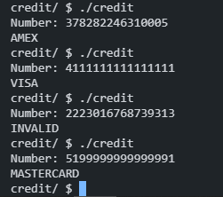

---

## 02 - Arrays  

Scrabble, Readability, Substitution

- **Scrabble** - Simple scrabble-like program that give points depending on letters for a given word.

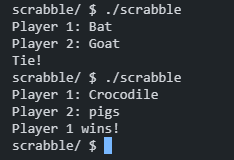

- **Readability** – Determines the reading level of a given text using the Coleman-Liau index.

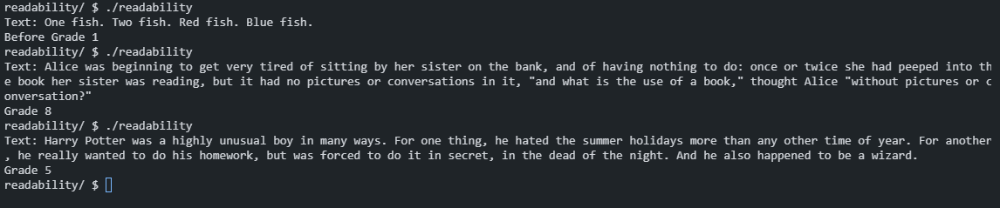

- **Substitution** – Implements a more flexible substitution cipher.

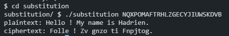

---

## 03 - Algorithms  

Plurality, Tideman

  
- **Plurality** – Implements a simple plurality voting system.

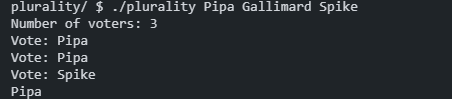

- **Tideman** – Implements a ranked-choice voting system using graph theory.

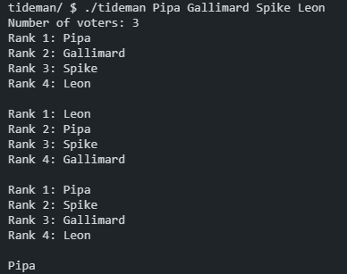

---

## 04 - Memory

Volume, Filter-more, Recover

- **Volume** – Modify an input’s volume by adjusting its memory allocation.
  
  

  
  
Sounds

  
  
  https://github.com/user-attachments/assets/dc9e0ad2-6342-45ba-9b8e-7dadc155ab29
  > Base - 1.0
  
  
  https://github.com/user-attachments/assets/d5a8ff06-b469-4533-9626-6f1303c43b6e
  > Halfed - 0.5
  
  
  https://github.com/user-attachments/assets/03705c17-33ec-4d25-8db4-8a3e855ed4a8
  > Doubled - 2.0
  
  ---
  

- **Filter-more** – Applies image filters like grayscale, blur, reversed and edge detection using image processing techniques.

  

  
  
Filter images

    
  
  > Base image
  
  
  > Grayscale generated
  
  
  > Reverse image generated
  
  
  > Blur generated
  
  
  > Edge detection generated
  
  ---
  

- **Recover** – Recovers deleted JPEG files from a raw memory file.
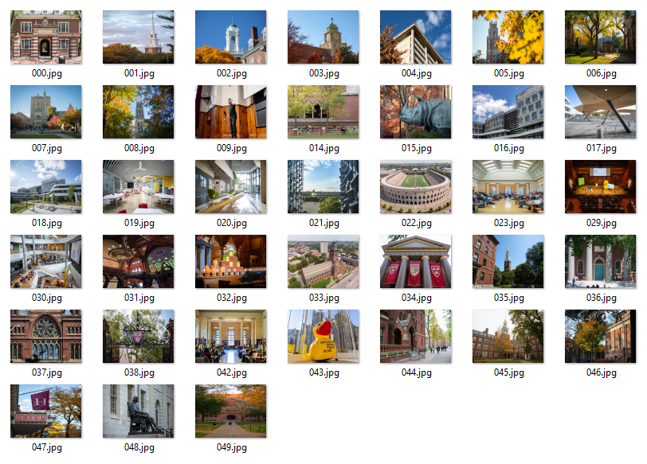
>Recovered images from card.raw

---

## 05 - Data Structures

Inheritance, Speller

  
- **Inheritance** – Simulates blood type inheritance across generations using a recursive tree-like structure.

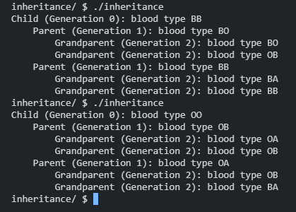

- **Speller** – Implements a spell checker using a hash table.

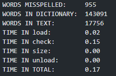

---

## 06 - Python  

Hello, Mario, credit, readability, dna

- **Sentimental Hello** – Basic Python program that prints "hello, world."

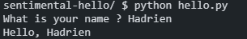
  
- **Sentimental Mario** – Re-implementation of the Mario pyramid in Python.

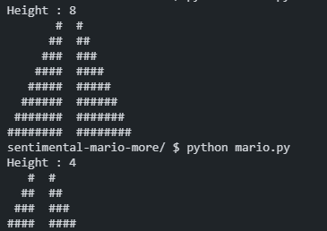

- **Sentimental Credit** – Credit card validation using Python.

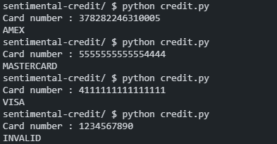

- **Sentimental Readability** – Determines the reading level of a given text using the Coleman-Liau index.

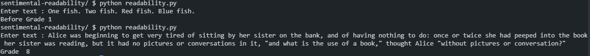

- **DNA** - Identifies the owner of a DNA sequence by comparing STR counts with a database of known individuals.

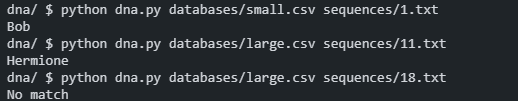

---

## 07 - SQL  

- **Songs** – Queries a database of songs to find specific information.
- **Movies** – Queries a database of movies to find specific more complexe information. 
- **Fiftyville** – A log of queries from the database of a town with multiple clues to identify a thief, their destination, and accomplices.
  
## 08 - Web Programming 
- **Trivia** – A simple website using HTML, CSS, and JavaScript in form of a trivia.
 
- **Homepage** – A simple personal website using HTML, CSS, and JavaScript.  

---

Feel free to explore each problem set folder for the source code and explanations of my solutions! 🚀  
