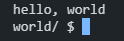
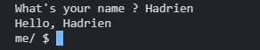
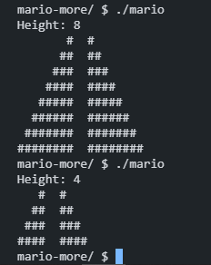
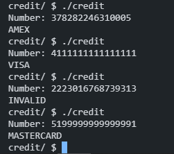
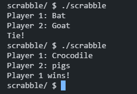
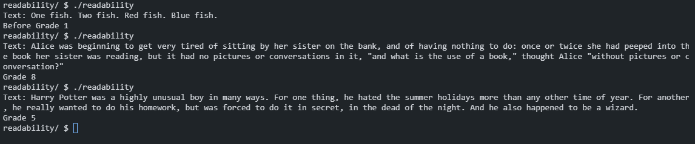
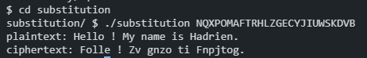
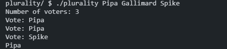
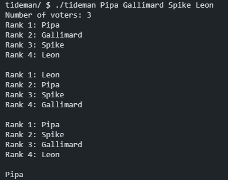

# 👨‍💻 Problem sets collection

## Introduction  
This repository contains my solutions to the problem sets from **Harvard's CS50: Introduction to Computer Science**. CS50 is an intensive introduction to computer science that covers fundamental programming concepts, algorithms, and data structures using languages like **C, Python, SQL, and JavaScript**.  

Each problem set challenges students with practical programming tasks that reinforce computational thinking and problem-solving skills. Below, you will find an organized list of all the problem sets, each with its respective exercises that i did between january and march 2025

---

### 01 - Basics of the language C 

Hello, Hello Name, Mario, Credit

- **Hello** – Famous Basic C program that prints "hello, world."

- **Hello Name** – Little twist of the "hello, world" where user need to input a name and prints "hello, name"

- **Mario (More)** – Ask height and prints a pyramid of blocks inspired by Super Mario.

  
- **Credit** – A program that verifies credit card numbers using Luhn’s Algorithm and identifies the card network.
 

### 02 - Arrays  

Scrabble, Readability, Substitution

- **Scrabble** - Simple scrabble-like program that give points depending on letters for a given word.

- **Readability** – Determines the reading level of a given text using the Coleman-Liau index.

- **Substitution** – Implements a more flexible substitution cipher.

### 03 - Algorithms  

Plurality, Tideman

  
- **Plurality** – Implements a simple plurality voting system.

- **Tideman** – Implements a ranked-choice voting system using graph theory.

### 03 - Memory

Volume, Filter-more, Recover

- **Volume** – Modify an input’s volume by adjusting its memory allocation.

<audio controls>
  <source src="[https://raw.githubusercontent.com//HadrienEcly/CS50_ProblemSets/main/04_Memory/volume/input.wav](https://raw.githubusercontent.com/HadrienEcly/CS50_ProblemSets/main/04_Memory/volume/input.wav")" type="audio/wav">
</audio>

- **Filter-more** – Applies image filters like grayscale, blur, reversed and edge detection using image processing techniques.  
- **Recover** – Recovers deleted JPEG files from a raw memory file.
  

### 5) Data Structures  
- **Speller** – Implements a spell checker using a hash table.   

### 6) Python  
- **Hello** – Basic Python program that prints "hello, world."  
- **Mario (Less & More)** – Re-implementation of the Mario pyramid in Python.  
- **Cash** – Change-making problem solved in Python.  
- **Credit** – Credit card validation using Python.  

### 7) SQL  
- **Movies** – Queries a database of movies to find specific information.  

### 8) Web Programming  
- **Homepage** – A simple personal website using HTML, CSS, and JavaScript.  

---

Feel free to explore each problem set folder for the source code and explanations of my solutions! 🚀  
